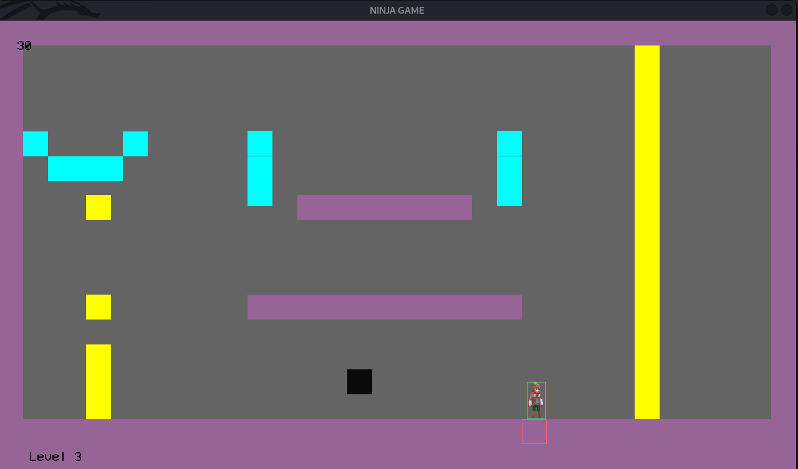
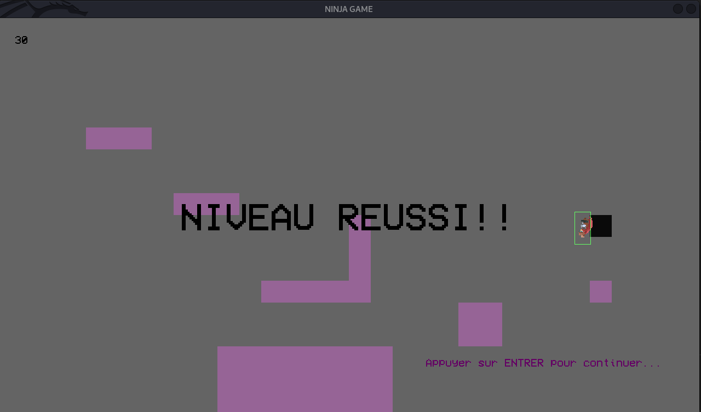
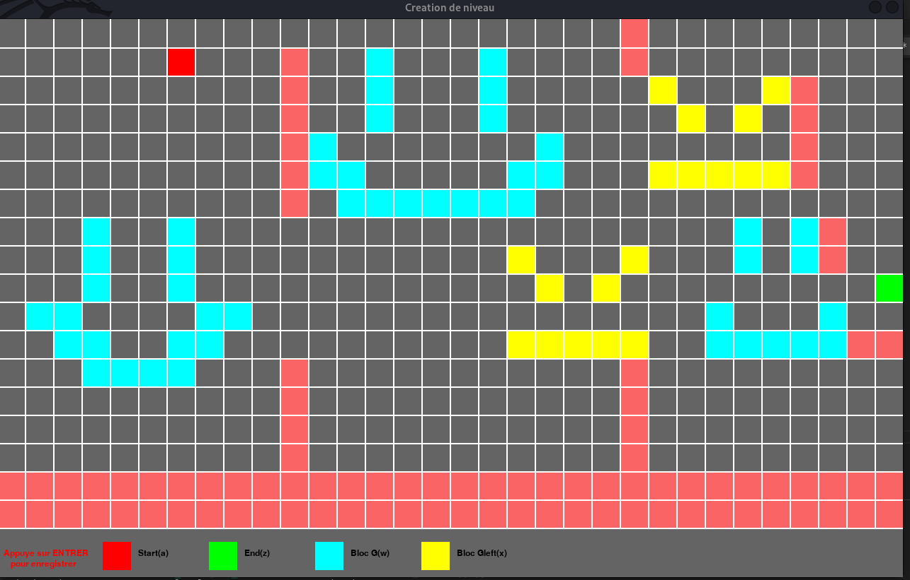

<h1>Game_collision</h1>

It was a game to test collision
It finnaly ends like this soooo...

You can play multiple levelll

<h3>Compilation</h3>

You have to install g++, libsdl-dev, libsdl-image1.2-dev, libsdl-ttf2.0-dev and make 
Then you just have to run "make"

<code> ~$ sudo apt-get install build-essential</code> 
<code> ~$ sudo apt-get install libsdl-dev libsdl-image1.2-dev libsdl-ttf2.0-dev</code> 
<code> ~$ make</code> 

<h3>Create your own level</h3>

There is a script in python 
You have to install python, pip and pygame
Here to install pygame on python3
<code> ~$ python3 -m pip install pygame</code> 

Then you can launch the script and have fun create level

